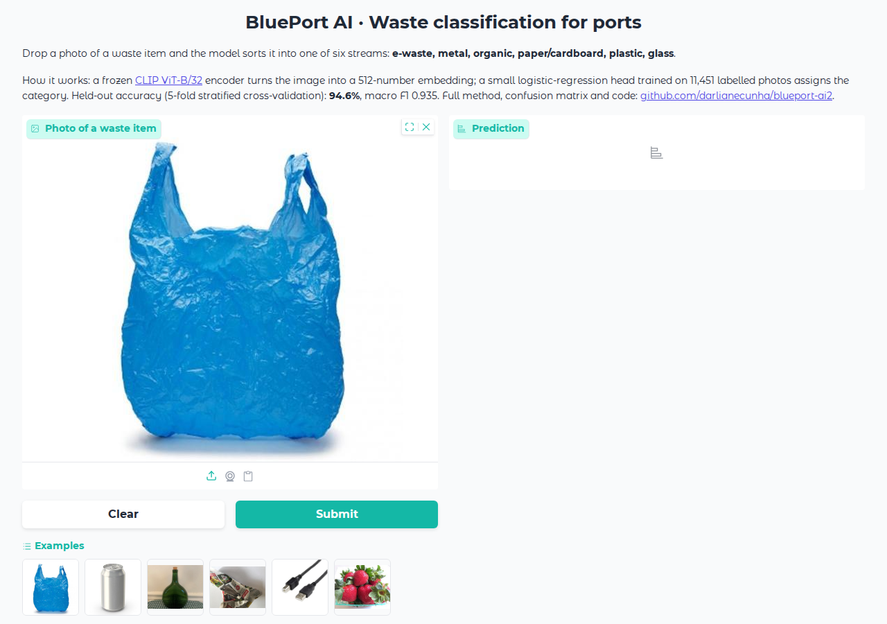
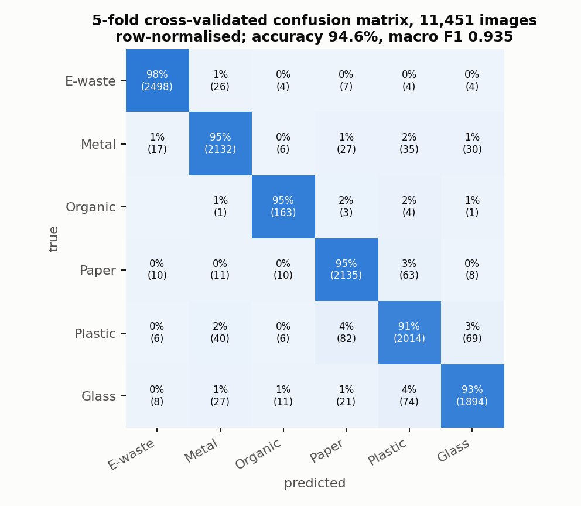

# BluePort AI · Waste classification for ports

**Computer vision that sorts waste photos into six recycling streams with a frozen CLIP encoder and a 3,078-parameter linear probe: 94.6% cross-validated accuracy on 11,451 images, served as a public demo and as an offline Telegram bot**

[](https://blue-port-ia.vercel.app/#try)
[](https://huggingface.co/spaces/Darliane/blueport-ai)
[](https://blue-port-ia.vercel.app)
[](LICENSE)


<p align="center">
  
</p>

## What this is

A user sends a photo of a waste item; the system returns the recycling stream (e-waste, metal, organic, paper/cardboard, plastic or glass) with a confidence score and a handling hint. Instead of fine-tuning a vision model, the frozen [CLIP ViT-B/32](https://huggingface.co/openai/clip-vit-base-patch32) encoder produces a 512-dimensional embedding and a logistic-regression head does the classification. Training the head takes seconds on a laptop and the weights are 16 KB.

The project started in the Omdena *Ganges River plastic interceptor* challenge (riverine plastic detection) and was adapted to port waste streams, where MARPOL Annex V requires segregation of ship-generated waste, as part of research on port sustainability at the Federal University of Maranhão.

Two ways to use it:

| Interface | Where it runs | For whom |
|---|---|---|
| **Web demo** | Runs inside the visitor's browser (CLIP in ONNX via Transformers.js); hosted on [blue-port-ia.vercel.app](https://blue-port-ia.vercel.app/#try) and mirrored on Hugging Face | Anyone: drop a photo, read the result; no photo is uploaded |
| **Telegram bot** (`waste_bot.py`) | Your own machine, fully offline, no image leaves it | Field use where privacy matters |

## Results

Evaluation is 5-fold stratified cross-validation on all 11,451 images (every image is predicted by a model that never saw it). An earlier version of this README reported 95.2%, measured on the training images; the cross-validated figure below is the one to quote.

| Class | Images | Precision | Recall | F1 |
|---|---|---|---|---|
| E-waste | 2,543 | 0.984 | 0.982 | 0.983 |
| Metal | 2,247 | 0.953 | 0.949 | 0.951 |
| Organic | 172 | 0.815 | 0.948 | 0.876 |
| Paper / cardboard | 2,237 | 0.938 | 0.954 | 0.946 |
| Plastic | 2,217 | 0.918 | 0.908 | 0.913 |
| Glass | 2,035 | 0.944 | 0.931 | 0.937 |
| **All** | 11,451 | **accuracy 0.946** | balanced accuracy 0.945 | macro F1 0.935 |

## Gallery

| Cross-validated confusion matrix | The demo |
|---|---|
|  |  |

Most errors are between plastic, paper and glass containers of similar shape. Organic is the smallest class; class weighting lifts its recall to 95% at some cost in precision.

## Method

```
photo → CLIP ViT-B/32 image encoder (frozen) → 512-d embedding, L2-normalised
      → logistic regression (6 × 512 weights + 6 biases, class-balanced) → softmax → label, confidence
```

- Confidence below 50% is flagged as uncertain (mixed item, unusual object or outside the six classes).
- The bot additionally supports CLIP zero-shot classification with hand-written prompts (`waste_vision.py`) as a fallback when no trained head is available.
- Dataset: public waste-image collections including TACO and TrashNet, checked with `check_dataset.py` (corrupted files quarantined). Not redistributed here (1.9 GB).

## Reproducing

```bash
pip install -r requirements.txt
# 1. put images in dataset/<class>/ (six folders)
python extract_features.py --dataset dataset      # feats.npy, labels.npy, index.json (about 10 min on CPU)
python train_probe_cv.py                            # cross-validation report + probe.npz + blueport_linear_v2.pt
```

To run the Telegram bot offline:

```bash
cp .env.example .env        # add the token from @BotFather
python waste_bot.py
```

To run the web demo locally: `python -m http.server` inside the [blue-port-ia](https://github.com/darlianecunha/blue-port-ia) site folder and open `index.html`.

## Repository map

| Path | Content |
|---|---|
| `extract_features.py` | CLIP embeddings for a folder of images (Hugging Face `transformers`) |
| `train_probe_cv.py` | Cross-validation, final fit, export to `probe.npz` and `.pt` |
| `probe.npz`, `probe.json`, `classes.json` | Weights and class order (numpy for Python, JSON for the browser demo) |
| `blueport_linear_v2.pt` | Same weights as a PyTorch state dict for the bot |
| `eval_cv.json` | Full cross-validation report and confusion matrix |
| `waste_bot.py`, `waste_vision.py` | Telegram bot and inference engine (OpenAI `clip` package) |
| `train_linear_probe.py`, `eval_batch.py` | Original PyTorch training and batch evaluation (v1) |
| `check_dataset.py` | Dataset validation and quarantine |
| `labels.json` | Category taxonomy, Portuguese and English |
| `docs/gallery/` | Figures used in this README |

## Related projects

- [blue-port-ia](https://github.com/darlianecunha/blue-port-ia): the project website
- [atributosods](https://github.com/darlianecunha/atributosods): SDG assessment framework for ports, where waste management is one of the 84 indicators
- [maritimeco2](https://github.com/darlianecunha/maritimeco2): at-berth CO₂ estimation, the emissions side of port sustainability

## How to cite

Metadata in [`CITATION.cff`](CITATION.cff).

> Cunha, D. R. (2026). *BluePort AI: waste classification for ports using CLIP and a linear probe* (Version 2.0) [Software]. https://github.com/darlianecunha/blueport-ai2

## Author and licence

**Darliane Ribeiro Cunha, PhD**. [ribeirocunha.com](https://ribeirocunha.com) · [ORCID 0000-0003-2548-1237](https://orcid.org/0000-0003-2548-1237)

Code and weights: [MIT](LICENSE). CLIP weights: OpenAI, MIT. Training images: their respective public licences.
